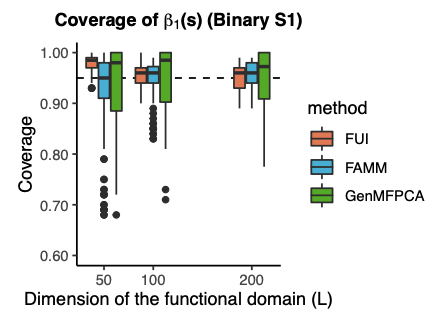

# Prepare package, data and functions

```{r}
library(dplyr)
library(readxl)
library(readr)
library(knitr)
library(haven)
library(visdat)
library(sjstats)
library(openxlsx)
library(stargazer)
library(broom)
library(ggplot2)
library(sjPlot)
library(stringr)
library(caret)
library(future)
library(purrr)
library(furrr)
library(here)
library(svrep)
library(patchwork)


######## Load Functions ########
source("src/00_sim_data_function.R")
source("src/01_sim_functions.R")
source("src/revised_func.R")
print('Functions have been loaded')
```

# Background

We plan to introduce survey design in the single level fast univariate
inference (FUI). In this session, we would like to conduct empirical
simulation using NHAES data to verify the effectiveness of the model.

We would consider two sampling scenarios in this part: (1)
Non-informative sampling; (2) Informative sampling.

**For Non-informative sampling:**

\(1\) Ignore original survey design in NHANES, and view subjects with
available Actigraph data in NHANES as the super-population.

\(2\) Simulate sample$_i$ from the super-population, using the specified
number of strata, PSUs, and the expected sample size within each
strata-PSU combination.

\(3\) Consider the following combinations to estimate and compare
point-wise (unadjusted) and joint-wise (CMA) cover ratio.

-   Survey weighted GLM + Survey-adjusted Bootstrap (e.g., Preston/RWYB
    Bootstrap)

-   Survey weighted GLM + Non-parametric bootstrap (fit weighted GLM in
    each bootstrap replicates)

-   Linear Regression + Non-parametric bootstrap (fit LR in each
    bootstrap replicates)

**Key Parameters that can affect model performance:**

\(1\) Whether smooth bootstrapped estimates for estimating variance

\(2\) Whether use smoothed bootstrapped estimates to conduct CMA to find
$q_{0.95}$

\(3\) How many knots used for smoothing bootstrapped estimates

\(4\) How many knots used for conducting fPCA

\(5\) The length of functional domain (6) The number of bootstrap number
for estimating variance

# True Population Effects

$$
y_i(s) = \beta_0(s) + X_i \beta_1(s) + \epsilon_i(s), \quad s = 1, 2, \ldots, 1440
$$

-   $y_i(s)$: PA monitoring data for individual i

-   $X_i$: Scalar covariate, and we consider age here

-   $\beta_0(s)$: Time-varying regression coefficients

-   $\epsilon_i(s) \sim N(0, \sigma^2(s))$

## Estimated effects from Linear Regression

### Raw Estimates

```{r}
# true coefficients
results.lr = read_rds('data/nhanes_true_effect_lr.rds') 

## True Coefficients and intercept (& Visualization)
results.lr |>
  mutate(Minutes = as.numeric(sub('min_', '', Variable)) ) |>
  select(-Variable) |>
  tidyr::pivot_longer(cols = c(Beta, Intercept), 
                      names_to = "Type",
                      values_to = "Value") |>
  ggplot(aes(x = Minutes, y = Value)) +
  geom_point(color = "blue",
             alpha = 0.6, size = 0.8) +   
  # geom_smooth(method = "loess",
  #             linewidth = 0.8, 
  #             color = "red", se = TRUE, span = 0.3) +
  facet_wrap(~ Type, scales = "free_y") + 
  labs(title = "True effects of beta and intercept throughout the day",
       x = "Minutes",
       y = "Beta") +
  theme(text = element_text(size = 14))
```

### Smoothed Estimates

```{r,warning=FALSE, results = 'hide', collapse=TRUE}
# true coefficients
results.lr = read_rds('data/nhanes_true_effect_lr_smoothed.rds') 

## True Coefficients and intercept (& Visualization)
results.lr |>
  mutate(Minutes = as.numeric(sub('min_', '', Variable)) ) |>
  select(-Variable) |>
  tidyr::pivot_longer(cols = c(Beta, Intercept), 
                      names_to = "Type",
                      values_to = "Value") |>
  ggplot(aes(x = Minutes, y = Value)) +
  geom_point(color = "blue",
             alpha = 0.6, size = 0.8) +
  # geom_smooth(method = "loess",
  #             linewidth = 0.8, 
  #             color = "red", se = TRUE, span = 0.3) +
  facet_wrap(~ Type, scales = "free_y") + 
  labs(title = "Smoothed true effects of beta and intercept throughout the day",
       x = "Minutes",
       y = "Beta") +
  theme(text = element_text(size = 14))
```

# Non-informative sampling

1.  Generate strata selection probabilities ($H=30$) from Dirichlet
    distribution
2.  Sample $N=\{15\}$ strata in the simulation
3.  For each strata $h$ in the selected strata:
    -   Standardize Age into mean=0 and SD=1
    -   Calculate inclusion probabilities $p_i = exp(Age_{i}/2)$
    -   Normalize: $p_{i'} = \frac{p_i}{\sum_{i \in h}p_i}$
    -   Adjust by expected number of individuals sampled
        $p_{i''} = min(p_{i'} * I_n * 2, 1)$
    -   Obtain sample using binomial sampling

## Domain Length & Performance

### L=150 & Default parameters

Length of functional domain: L = 150\
Bootstrap Number: B = 100\
Knots for smoothing bootstrapped estimates: L = 50\
Smooth bootstrapped estimates and use smoothed values to conduct CMA:\
smooth_for_ci = TRUE smooth_for_variance = TRUE\
Knots for conducting fPCA: L/2 = 75

```{r}
L = 150
all_results <- list.files("results/NI/", 
                          pattern = "sim_noOrigial_survey_L150_.*\\.rds", 
                          full.names = TRUE) %>%
  map_dfr(readRDS)

summary_design = all_results %>%
  group_by(boot_type, var) %>%
  summarise(
    MISE = mean(MISE),
    mean_joint_se = mean(mean_joint_se),
    mean_pw_se = mean(mean_pw_se),
    cover_joint_ratio = mean(cover_joint),
    cover_pw_ratio = mean(cover_pw) / L,
    .groups = 'drop'
  )

formatted_table <- summary_design %>%
  mutate(across(where(is.numeric), ~round(., 4)))  

kable(summary_design,
      digits = 4,  # control digital number 
      caption = "Summary Statistics",  # Simple Caption
      format = "html")
```

#### Visiualization (randome subject)

Length of functional domain: L = 150\
Bootstrap Number: B = 100\
Knots for smoothing bootstrapped estimates: L = 50\
Smooth bootstrapped estimates and use smoothed values to conduct CMA:\
smooth_for_ci = TRUE smooth_for_variance = TRUE\
Knots for conducting fPCA: L = 75

```{r, fig.width = 8, fig.height = 12}
var_name = c('Intercept', 'Beta')
L = 150
testL = 1:L
dat = read_rds('tmp_result/visualization_L150_noWeight_Smooth_fPCA0.5L.rds')

plot = list()
plot[['Preston']] = visualize_notCover(
  beta_true = t(results.lr |> select(-Variable))[, testL],
  mod_output = dat[[1]],
  L_domain = testL,
  subtitle = 'svylm & preston'
)
plot[['Weight']] = visualize_notCover(
  beta_true = t(results.lr |> select(-Variable))[, testL],
  mod_output = dat[[2]],
  L_domain = testL,
  subtitle = 'svylm & weight'
)
plot[['None']] = visualize_notCover(
  beta_true = t(results.lr |> select(-Variable))[, testL],
  mod_output = dat[[3]],
  L_domain = testL,
  subtitle = 'lm & lm CI%'
)

wrap_plots(plot, nrow = 3, ncol = 1) +
  plot_layout(guides = "collect") & 
  theme(legend.position = "bottom")
```

Green circle represents the point which is not covered by joint-wise
bands.


### L=500 & Default parameters

Length of functional domain: L = 500\
Bootstrap Number: B = 100\
Knots for smoothing bootstrapped estimates: L = 50\
Smooth bootstrapped estimates and use smoothed values to conduct CMA:\
smooth_for_ci = TRUE smooth_for_variance = TRUE\
Knots for conducting fPCA: L/2 = 250

```{r}
L = 500
all_results <- list.files("results/NI/", 
                          pattern = "sim_noOrigial_survey_L500_.*\\.rds", 
                          full.names = TRUE) %>%
  map_dfr(readRDS)

summary_design = all_results %>%
  group_by(boot_type, var) %>%
  summarise(
    MISE = mean(MISE),
    mean_joint_se = mean(mean_joint_se),
    mean_pw_se = mean(mean_pw_se),
    cover_joint_ratio = mean(cover_joint),
    cover_pw_ratio = mean(cover_pw) / L,
    .groups = 'drop'
  )

formatted_table <- summary_design %>%
  mutate(across(where(is.numeric), ~round(., 4)))  

kable(summary_design,
      digits = 4,  # control digital number 
      caption = "Summary Statistics",  # Simple Caption
      format = "html")
```

### L=1440 & Default parameters

Length of functional domain: L = 500\
Bootstrap Number: B = 100\
Knots for smoothing bootstrapped estimates: L = 50\
Smooth bootstrapped estimates and use smoothed values to conduct CMA:\
smooth_for_ci = TRUE smooth_for_variance = TRUE\
Knots for conducting fPCA: L/2 = 720

```{r}
L = 1440
all_results <- list.files("results/NI/NI_noWeight_default/", 
                          pattern = "NI_noWeight_default_.*\\.rds", 
                          full.names = TRUE) %>%
  map_dfr(readRDS)

summary_design = all_results %>%
  group_by(boot_type, var) %>%
  summarise(
    MISE = mean(MISE),
    mean_joint_se = mean(mean_joint_se),
    mean_pw_se = mean(mean_pw_se),
    cover_joint_ratio = mean(cover_joint),
    cover_pw_ratio = mean(cover_pw) / L,
    .groups = 'drop'
  )

formatted_table <- summary_design %>%
  mutate(across(where(is.numeric), ~round(., 4))) 

kable(summary_design,
      digits = 4,  # control digital number 
      caption = "Summary Statistics",  # Simple Caption
      format = "html")
```

Interestingly, the jw-coverage raio decrease as the length of function
domain increases. When n=150, the jw-coverage ratio is about 0.90.
However, as n increases to 500, the ratio decreases to 0.770.

#### FUI's simulation results (Eijia, 2022)



Interestingly, we can see the coverage ratio also declines in Eijia's
FUI paper as the domain number increases. But the number is limited to
200 here, not sure whether it also keeps as the number continuously
increase.

## Scenario Exploration

### L=1440 & Increase fPCA knots

Length of functional domain: L = 1440\
Bootstrap Number: B = 100\
Knots for smoothing bootstrapped estimates: L = 50\
Smooth bootstrapped estimates and use smoothed values to conduct CMA:\
smooth_for_ci = TRUE smooth_for_variance = TRUE\
Knots for conducting fPCA: 0.75\*L = 1080

```{r}
L = 1440
all_results <- list.files("results/NI/NI_noWeight_increaseFPCA/", 
                          pattern = "NI_noWeight_increaseFPCA_.*\\.rds", 
                          full.names = TRUE) %>%
  map_dfr(readRDS)

summary_design = all_results %>%
  group_by(boot_type, var) %>%
  summarise(
    MISE = mean(MISE),
    mean_joint_se = mean(mean_joint_se),
    mean_pw_se = mean(mean_pw_se),
    cover_joint_ratio = mean(cover_joint),
    cover_pw_ratio = mean(cover_pw) / L,
    .groups = 'drop'
  )

formatted_table <- summary_design %>%
  mutate(across(where(is.numeric), ~round(., 4))) 

kable(summary_design,
      digits = 4,  # control digital number 
      caption = "Summary Statistics",  # Simple Caption
      format = "html")
```

### L=1440 & No smooth

Length of functional domain: L = 1440\
Bootstrap Number: B = 100\
smooth_for_ci = FALSE\
smooth_for_variance = FALSE\
Knots for conducting fPCA: 0.5\*L = 720

```{r}
L = 1440
all_results <- list.files("results/NI/NI_noWeight_noSmooth/", 
                          pattern = "NI_noWeight_noSmooth_.*\\.rds", 
                          full.names = TRUE) %>%
  map_dfr(readRDS)

summary_design = all_results %>%
  group_by(boot_type, var) %>%
  summarise(
    MISE = mean(MISE),
    mean_joint_se = mean(mean_joint_se),
    mean_pw_se = mean(mean_pw_se),
    cover_joint_ratio = mean(cover_joint),
    cover_pw_ratio = mean(cover_pw) / L,
    .groups = 'drop'
  )

formatted_table <- summary_design %>%
  mutate(across(where(is.numeric), ~round(., 4))) 

kable(summary_design,
      digits = 4,  # control digital number 
      caption = "Summary Statistics",  # Simple Caption
      format = "html")
```

### L=1440 & No smooth & increase fPCA

Length of functional domain: L = 1440\
Bootstrap Number: B = 100\
smooth_for_ci = FALSE, smooth_for_variance = FALSE\
Knots for conducting fPCA: 0.75\*L = 1080

```{r}
L = 1440
all_results <- list.files("results/NI/NI_noWeight_FPCA_noSmooth_0505/", 
                          pattern = "NI_noWeight_FPCA_noSmooth_0505_.*\\.rds", 
                          full.names = TRUE) %>%
  map_dfr(readRDS)

summary_design = all_results %>%
  group_by(boot_type, var) %>%
  summarise(
    MISE = mean(MISE),
    mean_joint_se = mean(mean_joint_se),
    mean_pw_se = mean(mean_pw_se),
    cover_joint_ratio = mean(cover_joint),
    cover_pw_ratio = mean(cover_pw) / L,
    .groups = 'drop'
  )

formatted_table <- summary_design %>%
  mutate(across(where(is.numeric), ~round(., 4))) 

kable(summary_design,
      digits = 4,  # control digital number 
      caption = "Summary Statistics",  # Simple Caption
      format = "html")
```

### L=1440 & smooth CI & increase fPCA

Length of functional domain: L = 1440\
Bootstrap Number: B = 100\
Knots for smoothing bootstrapped estimates: L = 50\
Smooth bootstrapped estimates and use smoothed values to conduct CMA:\
smooth_for_ci = TRUE smooth_for_variance = FALSE\
Knots for conducting fPCA: 0.75\*L = 1080

```{r}
L = 1440
all_results <- list.files("results/NI/NI_noWeight_FPCA_smoothCI/", 
                          pattern = "NI_noWeight_FPCA_smoothCI.*\\.rds", 
                          full.names = TRUE) %>%
  map_dfr(readRDS)

summary_design = all_results %>%
  group_by(boot_type, var) %>%
  summarise(
    MISE = mean(MISE),
    mean_joint_se = mean(mean_joint_se),
    mean_pw_se = mean(mean_pw_se),
    cover_joint_ratio = mean(cover_joint),
    cover_pw_ratio = mean(cover_pw) / L,
    .groups = 'drop'
  )

formatted_table <- summary_design %>%
  mutate(across(where(is.numeric), ~round(., 4))) 

kable(summary_design,
      digits = 4,  # control digital number 
      caption = "Summary Statistics",  # Simple Caption
      format = "html")
```

### L=1440 & smooth CI & increase fPCA

Length of functional domain: L = 1440\
Bootstrap Number: B = 100\
Knots for smoothing bootstrapped estimates: L = 50\
Smooth bootstrapped estimates and use smoothed values to conduct CMA:\
smooth_for_ci = TRUE smooth_for_variance = FALSE\
Knots for conducting fPCA: 0.75\*L = 1080

```{r}
L = 1440
all_results <- list.files("results/NI/NI_noWeight_FPCA_smoothCI_adjustSTD/", 
                          pattern = "NI_noWeight_FPCA_smoothCI_adjustSTD.*\\.rds", 
                          full.names = TRUE) %>%
  map_dfr(readRDS)

summary_design = all_results %>%
  group_by(boot_type, var) %>%
  summarise(
    MISE = mean(MISE),
    mean_joint_se = mean(mean_joint_se),
    mean_pw_se = mean(mean_pw_se),
    cover_joint_ratio = mean(cover_joint),
    cover_pw_ratio = mean(cover_pw) / L,
    .groups = 'drop'
  )

formatted_table <- summary_design %>%
  mutate(across(where(is.numeric), ~round(., 4))) 

kable(summary_design,
      digits = 4,  # control digital number 
      caption = "Summary Statistics",  # Simple Caption
      format = "html")
```


## Visiualization (randome subject)

### Scenario 1

Length of functional domain: L = 150\
Bootstrap Number: B = 100\
Knots for smoothing bootstrapped estimates: L = 50\
Smooth bootstrapped estimates and use smoothed values to conduct CMA:\
smooth_for_ci = TRUE smooth_for_variance = TRUE\
Knots for conducting fPCA: L = 75

```{r, fig.width = 8, fig.height = 12}
var_name = c('Intercept', 'Beta')
L = 150
testL = 1:L
dat = read_rds('tmp_result/visualization_L150_noWeight_Smooth_fPCA0.5L.rds')

plot = list()
plot[['Preston']] = visualize_notCover(
  beta_true = t(results.lr |> select(-Variable))[, testL],
  mod_output = dat[[1]],
  L_domain = testL,
  subtitle = 'svylm & preston'
)
plot[['Weight']] = visualize_notCover(
  beta_true = t(results.lr |> select(-Variable))[, testL],
  mod_output = dat[[2]],
  L_domain = testL,
  subtitle = 'svylm & weight'
)
plot[['None']] = visualize_notCover(
  beta_true = t(results.lr |> select(-Variable))[, testL],
  mod_output = dat[[3]],
  L_domain = testL,
  subtitle = 'lm & lm CI%'
)

wrap_plots(plot, nrow = 3, ncol = 1) +
  plot_layout(guides = "collect") & 
  theme(legend.position = "bottom")
```

Green circle represents the point which is not covered by joint-wise
bands.

### Scenario 2

Length of functional domain: L = 150\
Bootstrap Number: B = 100\
Don't smooth bootstrapped estimates & Don't use smoothed values to
conduct CMA\
smooth_for_ci = FALSE smooth_for_variance = FALSE\
Knots for conducting fPCA: L = 75

```{r, fig.width = 8, fig.height = 12}
var_name = c('Intercept', 'Beta')
L = 150
testL = 1:L
dat = read_rds('tmp_result/visualization_L150_noWeight_FPCA_noSmooth.rds')

plot = list()
plot[['Preston']] = visualize_notCover(
  beta_true = t(results.lr |> select(-Variable))[, testL],
  mod_output = dat[[1]],
  L_domain = testL,
  subtitle = 'svylm & preston'
)
plot[['Weight']] = visualize_notCover(
  beta_true = t(results.lr |> select(-Variable))[, testL],
  mod_output = dat[[2]],
  L_domain = testL,
  subtitle = 'svylm & weight'
)
plot[['None']] = visualize_notCover(
  beta_true = t(results.lr |> select(-Variable))[, testL],
  mod_output = dat[[3]],
  L_domain = testL,
  subtitle = 'lm & lm CI%'
)

wrap_plots(plot, nrow = 3, ncol = 1) +
  plot_layout(guides = "collect") & 
  theme(legend.position = "bottom")
```

## fPCA exploration
```{r}
var_name = c('Intercept', 'Beta')
L = 1440
dat = read_rds('results/NI/NI_noOrigial_visual_only3_verify_raw.rds')

# get_cis(betaTilde_boot = dat$res[[1]], 
#         betaHat = dat$betaHat, 
#         L=1440)

## Input parameters
betaTilde_boot = dat$res[[1]]
betaHat = dat$betaHat[[1]]
argvals = 1:L
B = ncol(betaTilde_boot[1, , ])
smooth_for_ci = FALSE
smooth_for_variance = FALSE
L = 1440
nknots_min = NULL
nknots_min_cov = 35
nknots_fpca_min = L/2

## smooth estimates and conduct fPCA
nknots <- min(round(L / 2), nknots_min)
nknots_cov <- ifelse(is.null(nknots_min_cov), 35, nknots_min_cov)
nknots_fpca <- nknots_fpca_min
# old: nknots_fpca <- min(round(L / 2), 35)
betaHat_boot <- array(NA, dim = c(nrow(betaHat), ncol(betaHat), ncol(betaTilde_boot[1, , ])))
betaHat.var <- array(NA, dim = c(L, L, nrow(betaHat)))

# # smooth
# for (b in 1:B) {
#   betaHat_boot[, , b] <- t(apply(betaTilde_boot[, , b], 1, function(x)
#     gam(x ~ s(
#       argvals, bs = "tp", k = (nknots + 1)
#     ), method = "GCV.Cp")$fitted.values))
# } # smooth each bootstrapped estimate (functional domain)

# for (r in 1:nrow(betaHat)) {
#   if (smooth_for_variance) {
#     betaHat.var[, , r] <- 1.2 * var(t(betaHat_boot[r, , ]))
#   } else{
#     betaHat.var[, , r] <- 1.2 * var(t(betaTilde_boot[r, , ]))
#   }
# }
# 
# for (r in 1:nrow(betaHat)) {
#   if (smooth_for_variance) {
#     betaHat.var[, , r] <- 1.2 * var(t(betaHat_boot[r, , ]))
#   } else{
#     betaHat.var[, , r] <- 1.2 * var(t(betaTilde_boot[r, , ]))
#   }
# }

N <- 10000
qn <- rep(0, length = nrow(betaHat))
set.seed(456)
i = 1
if (smooth_for_ci) {
  est_bs <- t(betaHat_boot[i, , ])
} else{
  est_bs <- t(betaTilde_boot[i, , ])
}

fit_fpca <- suppressWarnings(refund::fpca.face(est_bs, knots = nknots_fpca)) 
phi <- fit_fpca$efunctions
lambda <- fit_fpca$evalues
K <- length(fit_fpca$evalues)

pve <- lambda / sum(lambda)

# Total explained variation
cum_pve <- cumsum(pve)

pve_table <- data.frame(
  PC = seq_along(lambda),
  Eigenvalue = lambda,
  PVE = round(pve, 4),
  Cumulative_PVE = round(cum_pve, 4)
)

K <- length(lambda)
print(pve_table)
cat("Selected number of functional principal components (PCs):", K, "\n")
```


Some ideas and questions:


Some potential adjusted procedures / thoughts: 1. scaling factor (1.2);
dynamic one? e.g. 1+0.2\*log(L/50); no direct evidence to support. - Try
impirical one

2.  The estimated trajectory is too smooth compared to the original one?
    Increase knots when smoothing individual bootstrapped trajectory or
    estimating covariance matrix.

3.  sample points every 10 minutes and then run the empirical simulation
    based on these sparser point

4.  change selected sample?

### increase simulation times

Considered method: svyglm + Preston, Rao-Wu-Yue-Beaumont\
**Simulation number: 400**\
Bootstrap number for joint-CI: 100

nknots_min = L/2\
smooth_for_ci = FALSE\
smooth_for_variance = FALSE**\
**nknots_fpca_min = 30 + L\*0.75

```{r}
L = 1440
all_results <- list.files("results/NI/bootnumup//", 
                          pattern = "sim_noOrigial_survey_Knot_bootnumup_.*\\.rds", 
                          full.names = TRUE) %>%
  map_dfr(readRDS)

summary_design = all_results %>%
  group_by(boot_type, var) %>%
  summarise(
    MISE = mean(MISE),
    mean_joint_se = mean(mean_joint_se),
    mean_pw_se = mean(mean_pw_se),
    cover_joint_ratio = mean(cover_joint),
    cover_pw_ratio = mean(cover_pw) / L,
    .groups = 'drop'
  )

formatted_table <- summary_design %>%
  mutate(across(where(is.numeric), ~round(., 4)))  

kable(summary_design,
      digits = 4,  
      caption = "Summary Statistics",  
      format = "html")
```
